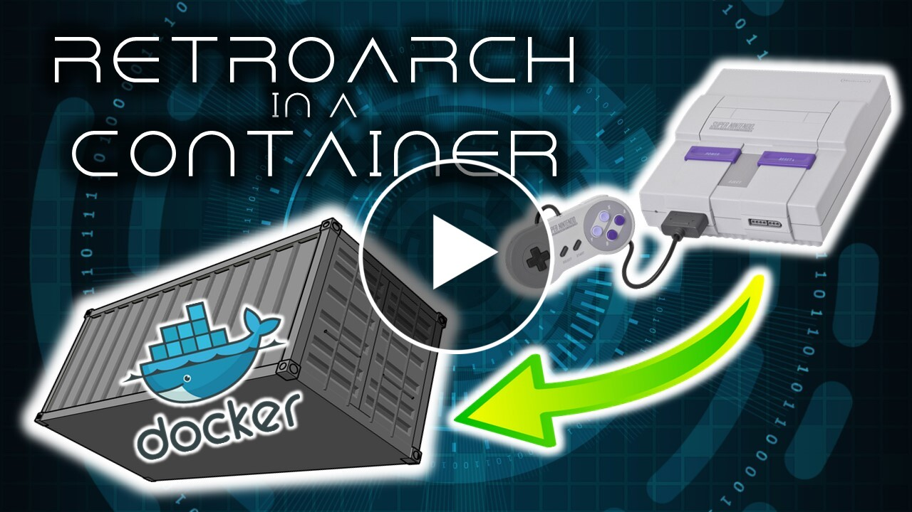

# RETRTOARCH IN A CONTAINER PLAYABLE THROUGH A BROWSER

RetroArch in a container typically requires that you have some kind of specialized client to play the games over the network. Not anymore. This implementation uses a web browser as the client without the need for anything else installed on your client.

The implementation is pretty straightforward. You can run it locally, or run it on a cloud-hosted service, like Azure Container Instances or Azure Kubernetes Services. In any case, you'll probably want to allocate at least 2 Gigs of RAM and 2 CPUs to make things run smoothly -- more for more graphic-intense emulators.

If you want to build it, simply clone the repo and run Docker Build.

`docker build -t retroarch . ` 

Alternately, you can pull the image from Docker Hub.

`docker pull blaize/retroarch`

To run this locally, run a Docker command:

`docker run -v /path/to/your/roms:/roms -p 80:80 blaize/retroarch`

Once the container is running, point your browser to the IP address or host name of your Docker environment. Retroarch has a basic install here.

***The Arrow Keys DO NOT WORK for some reason. Use the Num Pad to navigate or remap the keys in settings to your liking.***

1. On the Main Menu, go to and select "Update Core Info Files" and "Update Assets" to get the UI refreshes and a list of available Cores.
2. From th "Core Downloader," download your platform of choice.
3. Back on the Main Menu, select "Load Content" and browse to the folder `/roms` Pick your game and it will launch it.

Enjoy your retro gaming platform in the cloud!
